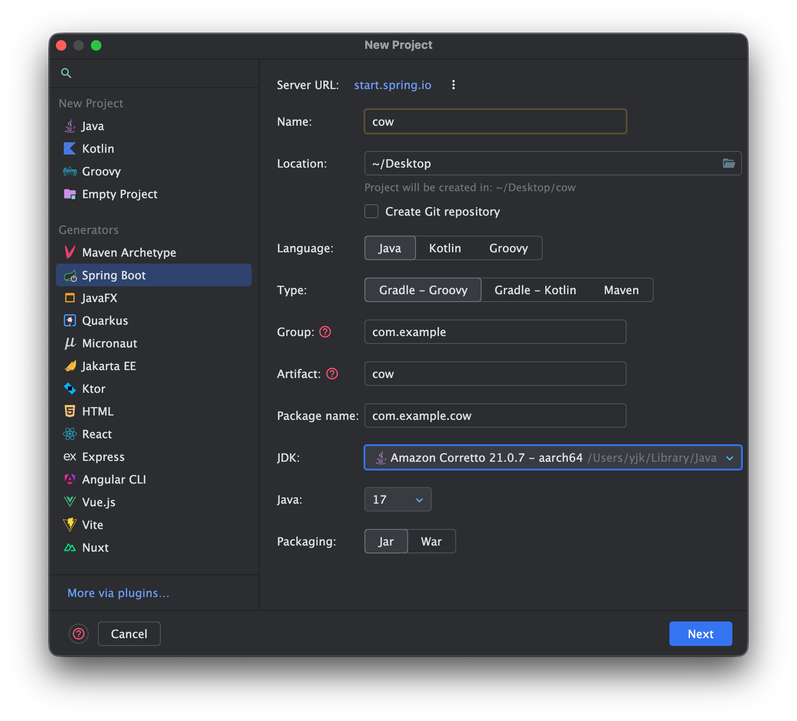
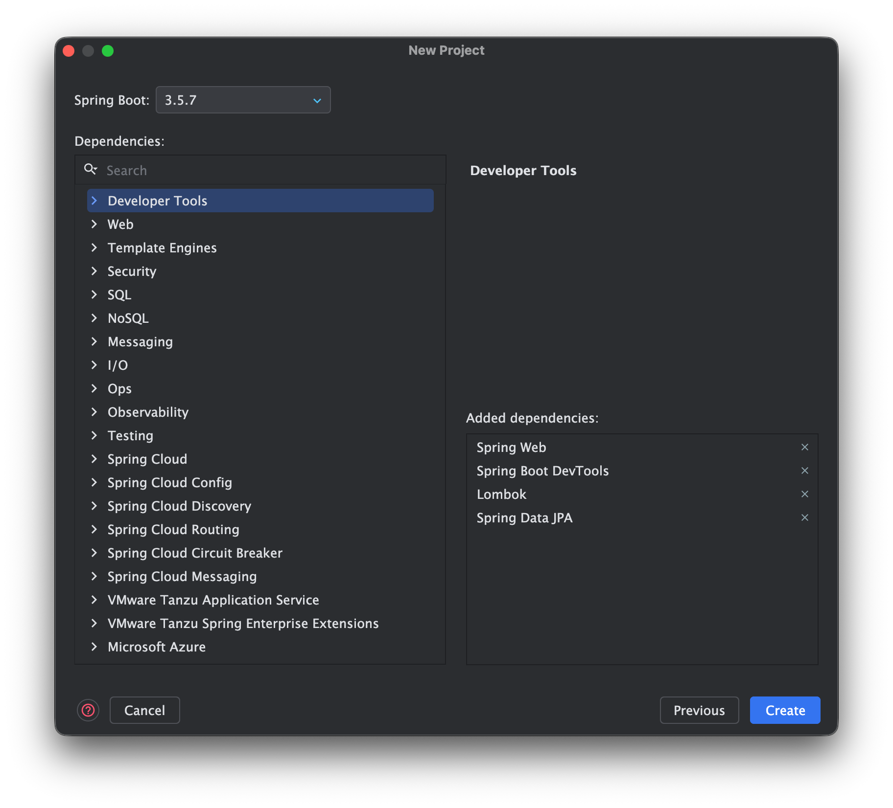

## 7주차 과제

---

### - Postman, Docker, Mysql 설치해오기

Postman: https://www.postman.com

Docker: https://www.docker.com

Mysql: https://dev.mysql.com/downloads/mysql/

---

- 스프링 어노테이션 조사하기

- 스프링 컨테이너 알아오기

- 할 수 있으면 Spring Project 생성 해보기

- 혹시 인텔리제이 커뮤니티에디션 사용하고 계신다면 학생 메일(mju.ac.kr) 인증 후 Ultimate Edition으로 업그레이드 하기

---

### 스프링 프로젝트 생성하는 법

1. IntelliJ에서 왼쪽 Spring Boot 선택
2. 프로젝트 생성할 위치(Location) 설정
3. JDK: 17 선택

4. 의존성(Dependencies): Spring Web, Spring Boot DevTools, Lombok, Spring Data JPA 선택
5. Create 눌러서 선택
